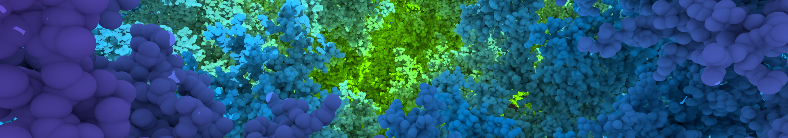

# VisRTX



VisRTX is an experimental, scientific visualization-focused implementation of
the [Khronos ANARI standard](https://www.khronos.org/anari), and is developed by
the HPC Visualization Developer Technology team at NVIDIA.

VisRTX is designed to track ongoing developments of the ANARI standard and
provide usable extensions where possible. Prospective backend implementors of
ANARI are encouraged to use VisRTX as a much more complete example of a
GPU-accelerated, ray tracing based implementation of ANARI.

Note that the ANARI implementation of VisRTX is a complete rewrite from previous
versions. Please refer to the `v0.1.6` release of VisRTX for the previous
implementation.

Please do not hesitate to provide feedback by [opening an
issue](https://github.com/NVIDIA/VisRTX/issues/new)!

## Build + Install

VisRTX is supported on both Linux and Windows.

### Core ANARI Library

Building VisRTX requires the following:

- CMake 3.17+
- C++17 compiler
- NVIDIA Driver 495+
- CUDA 11.3.1+
- [OptiX 7.4+](https://developer.nvidia.com/rtx/ray-tracing/optix)
- [ANARI-SDK 0.8.0](https://github.com/KhronosGroup/ANARI-SDK)

Building VisRTX is done through invoking CMake on the source directory from a
stand alone build directory. This might look like

```bash
mkdir build && cd build
cmake -DCMAKE_INSTALL_PREFIX=path/to/desired/install /path/to/visrtx/source
make
make install
```

The OptiX and ANARI-SDK dependencies can be found via placing their installation
locations on `CMAKE_PREFIX_PATH`, either as an environment variable or a CMake
variable.

The build will result in a single `libanari_library_visrtx` library that will
install to `${CMAKE_INSTALL_PREFIX}/lib`, and is usable with any ANARI app if
either it is installed to the same location as the ANARI-SDK or
`libanari_library_visrtx` is placed on `LD_LIBRARY_PATH` respectively.

### Provided Examples

VisRTX comes with a simple, single-file tutorial application that show how to
use VisRTX through the ANARI API. It is always enabled as it only requires the
ANARI SDK and compiles very quickly.

VisRTX also comes with an optional interactive example application that gives
application developers a sense of what VisRTX has to offer. To enable the
interactive example, simply turn on the `VISRTX_BUILD_INTERACTIVE_EXAMPLE`
option in your local CMake build.  This can be done with adding
`-DVISRTX_BUILD_INTERACTIVE_EXAMPLE=ON` to the CMake command above, or done with
either of the interactive CMake programs (`ccmake` or `cmake-gui`).

The interactive example requires [GLFW](https://www.glfw.org/) as an additional
dependency.

# Feature Overview

The following sections describes details of VisRTX's ANARI completeness,
provided extensions, and known missing extensions to add in the future.

## Queryable ANARI Extensions

In addition to standard `ANARI_KHR` extensions, the following extensions are
also implemented in the `visrtx` device. Note that all extensions are subject to
change

#### "VISRTX_ARRAY_CUDA" (experimental)

This extension indicates that applications can use pointers to CUDA device
memory when created shared and captured arrays when using VisRTX. This is
currently only working with `sharedStructured` spatial fields and is under
active development.

#### "VISRTX_CUDA_OUTPUT_BUFFERS"

This extension indicates that raw CUDA GPU buffers from frame objects can be
mapped for applications which are already using CUDA. The following additional
channels can be mapped:

- `"colorGPU"`
- `"depthGPU"`

GPU pointers returned by `anariMapFrame()` are device pointers intended to be
kept on the device. Applications which desire to copy data from the device back
to the host should instead map the ordinary `color` and `depth` channels.

#### "VISRTX_INSTANCE_ATTRIBUTES" (experimental)

This extension indicates that all attributes can be set as a single
`ANARI_FLOAT32_VEC4` value on the instance, which overrides any values on the
geometries within the instanced group.

#### "VISRTX_SPATIAL_FIELD_NANOVDB" (experimental)

This extension adds the ability to render
[NanoVDB](https://developer.nvidia.com/nanovdb) spatial fields. This subtype
takes a single array parameter called `data`, where the array is of type `UINT8`
containing the raw bytes containing of the grid data. Currently `float`,
`nanovdb::Fp4/8/16/N` grids are supported.

#### "VISRTX_TRIANGLE_FACE_VARYING_ATTRIBUTES" (experimental)

This extension indicates that additional attribute mappings are available for
the `triangle` geometry subtype. Specifically, the following face-unique vertex
attribute arrays can be specified:

- `faceVarying.normal`
- `faceVarying.color`
- `faceVarying.attribute0`
- `faceVarying.attribute1`
- `faceVarying.attribute2`
- `faceVarying.attribute3`

Each `faceVarying` attribute array is indexed by 3 * `primID` + `{0, 1, 2}`,
giving each triangle primitive a unique set of 3 vertex attributes. This follows
the USD definition of "face-varying" interpolated primvars.

If a `faceVarying` attribute array is present, it takes precedence over `vertex`
and `primitive` attribute arrays when they are also present.

## Additional ANARI Parameter and Property Extensions

The following section describes what additional parameters and properties can be
used on various ANARI objects.

#### Device

The device itself can take a single `INT32` parameter `"cudaDevice"` to select
which CUDA GPU should be used for rendering. Once this value has been set _and_
the implementation has initialized CUDA for itself, then changing this to
another value will be ignored (a warning will tell you this if it happens). The
device will initialize CUDA for itself if any object gets created from the
device.

#### Frame

The following properties are available to query on `ANARIFrame`:

| Name           | Type  | Description                                           |
|:---------------|:------|:------------------------------------------------------|
| numSamples     | INT32 | get the number of pixel samples currently accumulated |
| nextFrameReset | BOOL  | query whether the next frame will reset accumulation  |

The `numSamples` property is the lower bound of pixel samples taken when the
`checkerboard` renderer parameter (see below) is enabled because not every pixel
will have the same number of samples accumulated.

The `nextFrameReset` property can give the application feedback for when
accumulation is about to reset in the next frame. When the property is queried
and the current frame is complete, all committed objects since the last
rendering operation will be internally updated (may be expensive).

## List of Implemented ANARI Extensions

The following extensions are either partially or fully implemented by VisRTX:

- `KHR_ARRAY1D_REGION`
- `KHR_AUXILIARY_BUFFERS`
- `KHR_CAMERA_DEPTH_OF_FIELD`
- `KHR_CAMERA_ORTHOGRAPHIC`
- `KHR_CAMERA_PERSPECTIVE`
- `KHR_DEVICE_SYNCHRONIZATION`
- `KHR_FRAME_ACCUMULATION`
- `KHR_FRAME_CHANNEL_PRIMITIVE_ID`
- `KHR_FRAME_CHANNEL_OBJECT_ID`
- `KHR_FRAME_CHANNEL_INSTANCE_ID`
- `KHR_GEOMETRY_CONE`
- `KHR_GEOMETRY_CURVE`
- `KHR_GEOMETRY_CYLINDER`
- `KHR_GEOMETRY_QUAD`
- `KHR_GEOMETRY_SPHERE`
- `KHR_GEOMETRY_TRIANGLE`
- `KHR_INSTANCE_TRANSFORM`
- `KHR_INSTANCE_TRANSFORM_ARRAY`
- `KHR_LIGHT_DIRECTIONAL`
- `KHR_LIGHT_POINT`
- `KHR_MATERIAL_MATTE`
- `KHR_MATERIAL_PHYSICALLY_BASED`
- `KHR_SAMPLER_IMAGE1D`
- `KHR_SAMPLER_IMAGE2D`
- `KHR_SAMPLER_PRIMITIVE`
- `KHR_SAMPLER_TRANSFORM`
- `KHR_SPATIAL_FIELD_STRUCTURED_REGULAR`
- `KHR_VOLUME_TRANSFER_FUNCTION1D`
- `VISRTX_ARRAY_CUDA`
- `VISRTX_CUDA_OUTPUT_BUFFERS`
- `VISRTX_INSTANCE_ATTRIBUTES`
- `VISRTX_SPATIAL_FIELD_NANOVDB`
- `VISRTX_TRIANGLE_BACK_FACE_CULLING`
- `VISRTX_TRIANGLE_FACE_VARYING_ATTRIBUTES`

For any found bugs in extensions that are implemented, please [open an
issue](https://github.com/NVIDIA/VisRTX/issues/new)!
