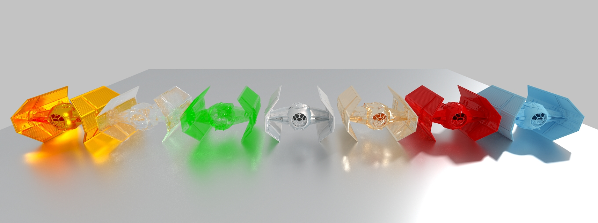

Introduction
============

VisRTX is a C++ rendering framework developed by the HPC Visualization Developer Technology team at NVIDIA.


<sub><sup>Mesh source: Kitware</sup></sub>


#### Key features ####
* Progressive forward pathtracing with next-event estimation and multiple importance sampling
* Hardware acceleration through NVIDIA OptiX (Multi GPU)
* Full MDL material support for physically-based BSDFs
* AI denoiser
* Triangle/sphere/cylinder/disk geometries
* Directional/sphere/quad/spot/ambient/HDRI area lights
* Perspective/orthographic cameras
* Depth of field
* Picking
* Tone mapping
* OpenGL interop
* Dynamic loading of VisRTX library
* Simple C++ interface


Please note that this is a **research project** and **work in progress**.


Installation
============

##### Supported Platforms #####
VisRTX is supported on both Linux and Windows.

##### Prerequisites #####
* [CUDA 10](https://developer.nvidia.com/cuda-toolkit) (Minimum: CUDA 8)
* [OptiX 6](https://developer.nvidia.com/optix) (Minimum: OptiX 5.1)
* [MDL SDK 2019](https://developer.nvidia.com/mdl-sdk)


##### Compile / Install #####
VisRTX requires a C++ compiler and uses the standard CMake compilation and installation procedure.

```bash
mkdir build && cd build
cmake PATH_TO_VISRTX
make
make install
```

##### Options #####

| CMake Option  | Description |
| ------------- | ------------- |
| `VISRTX_USAGE_REPORT_VERBOSITY`| Enables the usage report generated by OptiX. Possible values: 0/1/2/3. |
| `VISRTX_USE_DEBUG_EXCEPTIONS`| Compiles VisRTX and the underlying OptiX kernels with debug exception handling enabled. |
| `VISRTX_BUILD_SAMPLE`| Enables building of the sample applications. |
| `VISRTX_SAMPLE_USE_DYNAMIC_LOADING`| Use dynamic loading rather than dynamic linking in the samples to load VisRTX. |
| `VISRTX_SAMPLE_WITH_GLFW`| Enables GLFW-based OpenGL windows with GUI in the samples. |
| `VISRTX_SAMPLE_WITH_EGL`| Enables EGL-based OpenGL offscreen interop in the samples (Linux only). |


##### Compiling on Windows using Visual Studio 2017 #####

On Windows, VisRTX can be compiled using Visual Studio's built-in CMake support.

Just place a `CMakeSettings.json` file with the following contents (adjust paths accordingly) next to VisRTX's `CMakeLists.txt`:

```
{
  "configurations": [
    {
      "name": "x64-Release",
      "generator": "Ninja",
      "configurationType": "Release",
      "inheritEnvironments": [
        "msvc_x64_x64"
      ],
      "buildRoot": "C:\\.build\\VisRTX\\${name}",
      "installRoot": "C:\\.install\\VisRTX",
      "cmakeCommandArgs": "",
      "buildCommandArgs": "-v",
      "ctestCommandArgs": "",
      "variables": [
        { "name": "OptiX_INSTALL_DIR", "value": "C:\\PATH\\TO\\OptiX-SDK-6.0.0" },
        { "name": "MDL_INSTALL_DIR", "value": "C:\\PATH\\TO\\mdl-sdk-314800.830" },
        { "name": "VISRTX_BUILD_SAMPLE", "value": "ON" },
        { "name": "VISRTX_SAMPLE_USE_DYNAMIC_LOADING", "value": "ON" },
        { "name": "VISRTX_USAGE_REPORT_VERBOSITY", "value": "0" },
        { "name": "VISRTX_USE_DEBUG_EXCEPTIONS", "value": "OFF" }
      ]
    }
  ]
}
```


Examples
============

Several example applications are included showcasing and verifying the features of VisRTX.

The `visRtxSampleBasic` application combines most features of VisRTX in a single test bed using the general-purpose basic material, and has the optional parameters: `benchmark`, `offscreen`, `egl`, `dump`.

The `visRtxSampleMeshViewer` can be used to load a set of arbitrary OBJ meshes and apply MDL materials to them. 
`visRtxSampleMDL` loads a single mesh and renders multiple instances with various MDL materials.

Nested volumetric materials are demonstrated in `visRtxSampleVolume`.

The samples include a set of MDL material definitions based on the most common OSPRay materials with a similar parameter interface.
These include `::OBJMaterial`, `::CarPaint`, `::Principled`, `::Metal`, `::Alloy`, `::Glass`, `::ThinGlass`, `::MetallicPaint`, and can be found in `sample/data/ospray.mdl`.

Example command line: ` ./visRtxSampleMeshViewer ::OBJMaterial cow.obj ::CarPaint car.obj ::MetallicPaint --plane`

The samples can be easily changed to load MDL files and resources from disk, or switch from instance to class compilation.


Documentation
============

There is no official documentation yet, sorry!

The `VisRTX.h` header gives a concise overview of the API.

Most of the provided functionality is demonstrated in the included sample applications. See `sample/Sample.h` for basic framework setup.

Please note that this project is work in progress and the API as well as features can change.


##### Environment Variables #####

Some performance-relevant properties of the renderer can be overridden using the following environment variables, so an existing application can be tuned without recompilation.

| Environment Variable  | Values |
| ------------- | ------------- |
| `VISRTX_DEVICES`  | list of int, e.g., `0`, `1`, `0,1`  |
| `VISRTX_MIN_BOUNCES`  | int > 0  |
| `VISRTX_MAX_BOUNCES`  | int > 0  |
| `VISRTX_EPSILON`  | float >= 0  |
| `VISRTX_CLAMP_DIRECT`  | float >= 0  |
| `VISRTX_CLAMP_INDIRECT`  | float >= 0  |
| `VISRTX_TONE_MAPPING`  | 0/1  |
| `VISRTX_DENOISER`  | 0/1  |
| `VISRTX_SAMPLE_ALL_LIGHTS`  | 0/1  |


MDL
============

For more advanced materials check out [vMaterials](https://developer.nvidia.com/vmaterials), a curated collection of free-to-use MDL materials representing common real world materials used in Design and AEC workflows.

The [MDL wrapper](https://github.com/NVIDIA/VisRTX/tree/master/src/MDL) provided by VisRTX is self-contained and can be of interest to anyone who wants to access the MDL SDK from an OptiX-based application.

#### Features
 * Class and instance compilation
 * Load MDL from memory and disk (including texture resources)
 * Update parameters (and recompile if necessary)
 * Arbitrary OptiX samplers as parameters


Multi-GPU
============
VisRTX automatically makes use multiple GPUs if available. 

For best OpenGL interop performance, make sure to enable *Maximize 3D performance* in the SLI configuration.
It is also worthwhile to experiment with the CUDA device order, which can have a noticeable impact on the interop performance. For instance, in a dual GPU setup make sure to give `CUDA_VISIBLE_DEVICES='1,0'` a try!


Feedback
===================

Feedback, issues and pull requests welcome! 

We would love to hear more about your use cases of VisRTX!

If you have any questions, feature requests, issues, or ideas for improvement, please feel free to reach out at [tbiedert@nvidia.com](mailto:tbiedert@nvidia.com).
