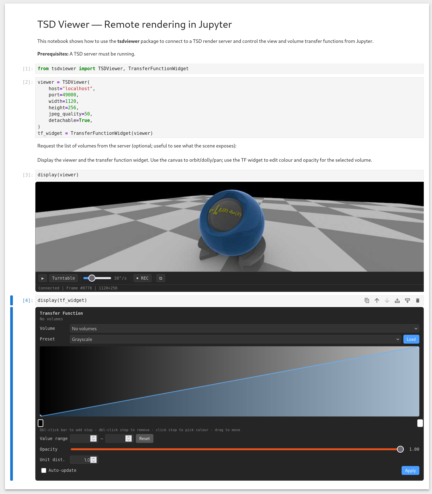

# TSD Viewer — Jupyter widget for remote rendering

The **tsdviewer** package provides Jupyter widgets to connect to a TSD (Time-Space Data) render server, display a live view, and control the camera and volume transfer functions from a notebook.



## Prerequisites

- **Python** 3.10+
- A **TSD render server** running (e.g. VisRTX-based server, GreenHorizon render server) on a known host and port (typically 12345).

## Installation

From the `tsdviewer` directory (this folder):

```bash
cd tsdviewer   # if you are in tsd/python
pip install -e .
```

Optional (for running the example notebook):

```bash
pip install -e ".[dev]"
```

## Quick start

```python
from tsdviewer import TSDViewer, TransferFunctionWidget

viewer = TSDViewer(
    host="localhost",
    port=12345,
    width=1120,
    height=540,
    jpeg_quality=50,
    detachable=True,
)
tf_widget = TransferFunctionWidget(viewer)

# Optional: list volumes exposed by the server
viewer.request_volume_list()

display(viewer)
display(tf_widget)
```

The viewer connects on creation by default. Use the canvas to orbit/dolly/pan; use the transfer function widget to edit colour and opacity for the selected volume.

## Example notebook

Run the demo notebook from the `tsdviewer` directory:

```bash
cd tsdviewer
jupyter notebook notebooks/tsdviewer_demo.ipynb
```

Or in JupyterLab: **File → Open** → `notebooks/tsdviewer_demo.ipynb`.

## Mouse controls

| Action           | Effect                    |
|------------------|---------------------------|
| **Left drag**    | Orbit (azimuth / elevation) |
| **Right drag**   | Dolly (distance)          |
| **Shift + Left** | Dolly                     |
| **Middle drag**  | Pan (look-at)             |
| **Alt + Left**   | Pan                       |
| **Scroll wheel** | Dolly                     |

## Features

- **Live view**: Streamed JPEG frames from the server; viewport resizes with the widget (or with a detachable popup window).
- **Transfer function widget**: Preset colormaps, opacity curve, value range, and server-specific sliders (e.g. opacity scale, unit distance).
- **Volume API**: `request_volume_list()`, `request_volume_info(index)`, `set_volume_attribute(...)`, and transfer-function updates sent to the server.
- **Camera animation**: `viewer.turntable(speed=30)`, `viewer.rock(speed=20, amplitude=60)`, `viewer.animate_to(...)`, `viewer.record_keyframe()`, `viewer.play_keyframes(duration=10)`, `viewer.stop_animation()`.

## API overview

| Component               | Description |
|-------------------------|-------------|
| `TSDViewer(host, port, ...)` | Main widget: viewport, camera, connection to TSD server. |
| `TransferFunctionWidget(viewer)` | Colour/opacity editor bound to the viewer’s selected volume. |
| `TSDClient`             | Low-level client (message types, connect, send view/frame config). Use `TSDViewer` unless you need custom messaging. |

See the docstrings in `tsdviewer.viewer`, `tsdviewer.transfer_function`, and `tsdviewer.tsd_client` for full API details.
